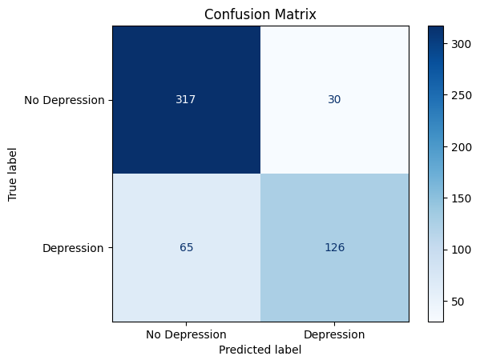
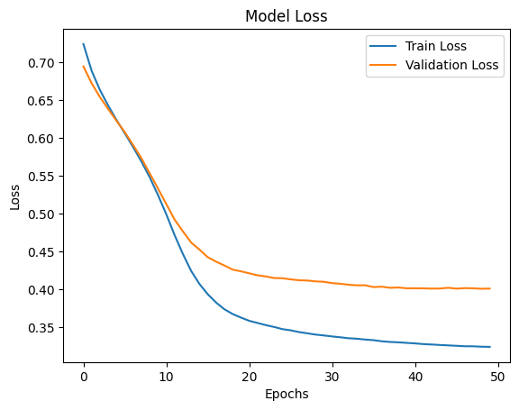
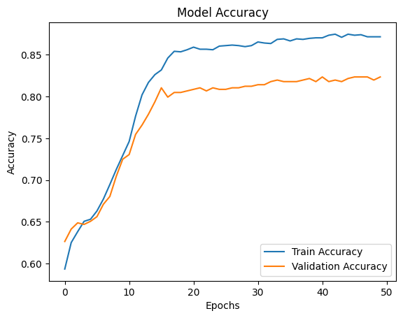

# 🧠 Alzheimer's Disease Detection using Federated Learning (Prototype)

---

## 📌 Project Overview
This repository presents a **baseline non-pipelined ANN** for Alzheimer's disease detection.  
The model serves as a **foundation for future experiments**, allowing privacy-preserving analysis across distributed datasets.

> ⚠️ **Note:** This is a prototype. The full implementation will be developed soon.

---

## 🗂 Repository Structure

| Folder/File | Description |
|-------------|-------------|
| `data/` | Placeholder for dataset (`alzheimers_disease_data.csv`) with README only |
| `src/` | Python scripts: `non_pipelined_ann.py` |
| `results/` | Confusion matrix, loss & accuracy curves |
| `README.md` | This file |
| `requirements.txt` | Python dependencies |
| `.gitignore` | Ignore unnecessary files |

---

## 🔬 Model Architecture

| Layer | Units | Activation |
|-------|-------|------------|
| Input |  —    | —          |
| Hidden Layer 1 | 4 | ReLU |
| Hidden Layer 2 | 4 | ReLU |
| Output Layer   | 1 | Sigmoid |

> This ANN acts as a centralized baseline. Future work includes **conversion to Federated Learning**.

---

## ⚙️ Features & Preprocessing
- Categorical feature encoding using **OneHotEncoder**
- Feature scaling via **StandardScaler**
- Train/test split: 75% / 25%
- Evaluation metrics:
  - Accuracy, Precision, Recall, F1-score
  - Confusion Matrix

---

## 📈 Results (Preliminary)

### Confusion Matrix

### Training & Validation Loss

### Training & Validation Accuracy

> These are preliminary results to demonstrate the baseline ANN functionality.  

---

## 🔮 Planned Extensions (Research Scope)

Click to expand planned FL extensions

- Convert baseline ANN into **Federated Learning setup** using Flower or PySyft
- Simulate **multiple clients** representing distributed hospitals
- Analyze **client heterogeneity** and communication efficiency
- Compare **pipelined vs non-pipelined ANN** in FL context
- Implement **privacy-preserving mechanisms** like differential privacy
- Explore model interpretability for clinical insights

